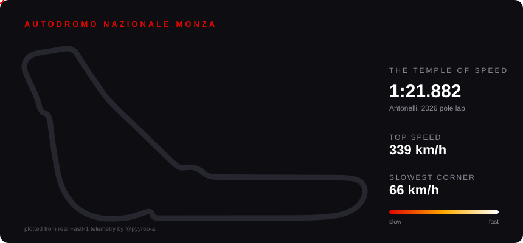

---

### 🏎️ DRIVER PROFILE

| **Driver** | Ashen |
|---|---|
| **Team** | Qatar University, Computer Science (final year) |
| **Racing for** | software engineering and applied ML, ideally motorsport data/performance one day |
| **Driving style** | I don't trust a result until I understand exactly why it's true |
| **Status** | 🟢 open to internships and full-time roles |

---

### 🏁 STARTING GRID

| POS | PROJECT | WHAT IT IS | BEST LAP |
|:---:|---|---|---|
| **P1** | [**PitWall**](https://github.com/pyyroo-a/Formula-1-Fantasy-Predictor) | ML app that picks my F1 Fantasy team every race weekend. XGBoost + FastAPI + React, deployed and updating itself every Monday | built an honest backtest, found my model lost to just picking by FP3 order (0/8), worked out why and shipped the thing that actually works |
| **P2** | [**F1 Strategy Lab**](https://github.com/pyyroo-a/f1-strategy-lab) | measures tyre wear per circuit from 2026 race data, then asks if a driver should've pitted differently. Pit loss, safety car Monte Carlo, what-if tool | Norris lost P2 at Spain to a pit stop 3.2s slower than his teammate's |
| **P3** | **driver-lines** 🔧 | racing lines from telemetry and aerial photos, working toward reading onboard video. Supervised by my computer vision professor | in the garage, not public yet |

---

### 📡 LIVE TIMING

<!-- LIVE-TIMING:START -->
**Spanish GP (R14)**

🏆 Winner: **Andrea Kimi Antonelli** 
🔮 PitWall called it: ✅ winner · **2/3** podium 
📏 Predicted order off by **3.1** places on average

auto-updated every Monday by a GitHub Action, straight from [PitWall's saved predictions](https://github.com/pyyroo-a/Formula-1-Fantasy-Predictor/tree/main/data/snapshots)
<!-- LIVE-TIMING:END -->

---

### 🔧 GARAGE / SETUP SHEET

    
 
     
 
     

---

### 📻 TEAM RADIO

> *"Ashen, if you wanna talk strategy, data, or both, the radio's open. Copy?"*

 

---

my favourite track, plotted from the real telemetry, replaying at the actual pace (the straights fly and the chicanes crawl)

